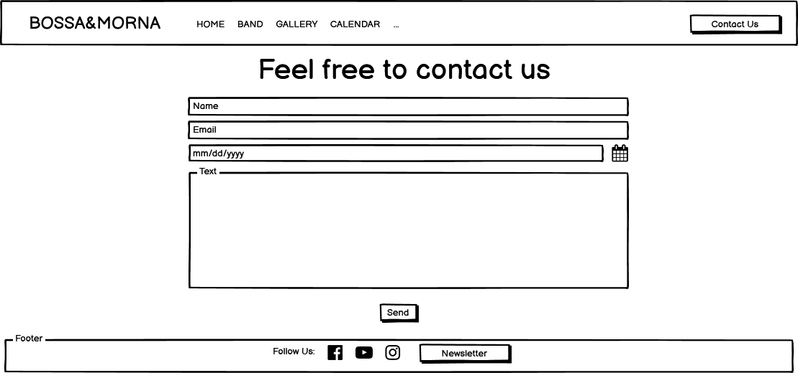

# Bossa&Morna Website

Bossa&Morna is a Portuguese band which combines portuguese, african and brazilian music. It is formed by three musicians singing, playing guitar and "cavaquinho" along with characteristic percussions from these three countries.
This website's goal is to present the band's history and elements along with some of their performances. Users can access to videos and photos displayed in the Gallery and enjoy what this amazing band has to offer.
The website includes a calendar where the user can see any upcoming events where the band will be performing. They can add to their calendar a specific event so that they don't forget.
Since the band is preparing to launch a new album, this website allows the user to provide its email address in order to be the first group of fans to receive a copy once the album is ready. 
There's also a calendar section where the user is able to see future events where the band perform. For any other topic, for example to book an event, the band can be contacted via an open form.
 
 This website's goals are:
* Increase the band's fan base.
* Create more proximity with the band's fans.
* Try to increase the revenue from sellinf their new album by giving the fans an opportunity to pre-order the new album.
* Give the opportunity for any agent of event organizer to get a good idea of their image as a band and to know their work.
* Make it easier for any agent or event organizer to contact the band and try to book an event.
 
 A live demo of website can be found [here](https://claudio-c-santos.github.io/Milestone-Project-1/). It is compatible from small to big screen sizes. 
 
## UX

The main users of this website will be fans, agents and event organizers. Each of them can use this website as a tool to obtain valuable information about the band and interact with them.

### <ins>**Desktop View**</ins>

### <ins>**Mobile View**</ins>

### User stories
- As a new user that doesn't know anything about the band, I want to know what type of music they play by hearing a song or two.
- As a new user that doesn't know anything about the band, I want to know more about the band and its musicians.
- As a new user that doesn't know anything about the band, I want to have a good idea of the band's image.
- As a fan, I want to be updated on the upcoming events, so that I can attend.
- As a fan, I want to be able to easily find links to their social media profiles, so that I can follow their work.
- As a fan, I want to play their songs on the website, so that I can enjoy it.
- As an agent, I want to know what type of music the band plays, so that I can decide if I should approach them to try represent them.
- As an agent, I want to contact the band, so that I can offer my services to represent them.
- As an event organizer, I want to contact the band, so that I can book their services for a specific day.

### Strategy
The goal of this website's design is to simplify the user experience and not make him waste too much time looking for what he needs and even find additional information that wasn't accounted for but ends up being useful.

### Scope
The information is displayed thinking about the three main users of this website. Everything is organized in order to make it fluid for everyone giving them an oportunity to perform the desired task and receive additonal and useful information

### Structure
The structure was thought to be fluid. When the user enters the website immediately has an overview of all the sections available going from home to a way to reaching out to the band.
On the home page the first that is shown is the fact that a new album will be released and that a pre-order can be submitted with a button that links to the related page.
Then there's a page about the band so that the user can have more insight on what the band is all about and a small biography on each of the musicians.
Gallery is divided in videos and pictures.
Then there are two forms, one to pre-order the new album and to contact the band. These two pages are linked by a side area with links between both of them.

### Wireframes

### <ins>**Home**</ins>

#### <ins>**Band**</ins>

#### <ins>**Gallery-Videos**</ins>

#### <ins>**Gallery-Photos**</ins>

#### <ins>**Calendar**</ins>

#### <ins>**Pre-Order**</ins>

#### <ins>**Contact Us**</ins>

### Surface

The color scheme was chosen from the album cover which was provided by the band's designer.

## Features

Each page of the website has its own features and serves a specific purpose, please find the details below:

- <ins>Navbar</ins> 
    - Displays in all pages with direct links for each of the other pages. 
      
    
     
- <ins>Footer</ins> 
    - Also displayed in every page, gives access to band's social media profiles and allows the user to subscribe to band's newsletter. 
     
    
     
- <ins>Home</ins> 
    - The home page is divided in three sections which are the announcement of the new album and link to pre-order form, carousel with some of pictures included in the gallery and a last section 
to incentivate the user to reach out to the band. 
     
    
     
- <ins>Band</ins> 
    - This page is to give a description of the band along with a brief biography of each musician. 
     
    
     
- <ins>Gallery</ins> 
    - This section is divided into two pages: videos and pictures of the band performing. 
     
    
     
    
     
- <ins>Calendar</ins> 
    - This page is where upcoming events are announced. 
     
    
     
- <ins>Contact Us/Pre-order</ins> 
    - These two pages include a form to contact the band and another one to pre-order the new album. 
     
    
     
    
     

### Existing Features

- Feature 1 
    - Allows a new user that doesn't know anything about the band to immediately see the available content by looking at the navigation bar.

- Feature 2 
    - Allows a new user that doesn't know anything about the band to know more about the band and its musicians by navigating to the band page. 
     

- Feature 3
    - Allows a new user that doesn't know anything about the band by navigating to the Gallery in order to have a good idea of the band's image. 
     

- Feature 4
    - Allows users to be updated on the upcoming events by navigating to the Calendar. The event can be added to the fans calendar by clicking the "Add to calendar" button. 
     

- Feature 5
    - Allows user to easily find links to their social media profiles by scrolling down to the pages footer. 
     

- Feature 6
    - Allows user to pre-order the band's new album by submitting their personal details and email address. 
     

- Feature 6
    - Allows user to have access to the band's newsletter byt submitting their email address in the form at the page's footer. 
     

- Feature 7
    - Allows user to contact the by navigating to the Contact Us form. This form allows to choose a date in case of wanting to book an event 
     

<!--
- Feature 1 - allows users X to achieve Y, by having them fill out Z
- ...

For some/all of your features, you may choose to reference the specific project files that implement them, although this is entirely optional.

In addition, you may also use this section to discuss plans for additional features to be implemented in the future:
-->

## Technologies Used

<!--
In this section, you should mention all of the languages, frameworks, libraries, and any other tools that you have used to construct this project. For each, provide its name, a link to its official site and a short sentence of why it was used.

- [JQuery](https://jquery.com)
    - The project uses **JQuery** to simplify DOM manipulation.
-->

## Testing

<!--
In this section, you need to convince the assessor that you have conducted enough testing to legitimately believe that the site works well. Essentially, in this part you will want to go over all of your user stories from the UX section and ensure that they all work as intended, with the project providing an easy and straightforward way for the users to achieve their goals.

Whenever it is feasible, prefer to automate your tests, and if you've done so, provide a brief explanation of your approach, link to the test file(s) and explain how to run them.

For any scenarios that have not been automated, test the user stories manually and provide as much detail as is relevant. A particularly useful form for describing your testing process is via scenarios, such as:

1. Contact form:
    1. Go to the "Contact Us" page
    2. Try to submit the empty form and verify that an error message about the required fields appears
    3. Try to submit the form with an invalid email address and verify that a relevant error message appears
    4. Try to submit the form with all inputs valid and verify that a success message appears.

In addition, you should mention in this section how your project looks and works on different browsers and screen sizes.

You should also mention in this section any interesting bugs or problems you discovered during your testing, even if you haven't addressed them yet.

If this section grows too long, you may want to split it off into a separate file and link to it from here.
-->

## Deployment

<!--
This section should describe the process you went through to deploy the project to a hosting platform (e.g. GitHub Pages or Heroku).

In particular, you should provide all details of the differences between the deployed version and the development version, if any, including:
- Different values for environment variables (Heroku Config Vars)?
- Different configuration files?
- Separate git branch?

In addition, if it is not obvious, you should also describe how to run your code locally.
-->

## Credits

### Content

<!--
- The text for section Y was copied from the [Wikipedia article Z](https://en.wikipedia.org/wiki/Z)
-->

### Media

<!--
- The photos used in this site were obtained from ...
-->

### Acknowledgements

<!--
- I received inspiration for this project from X
-->