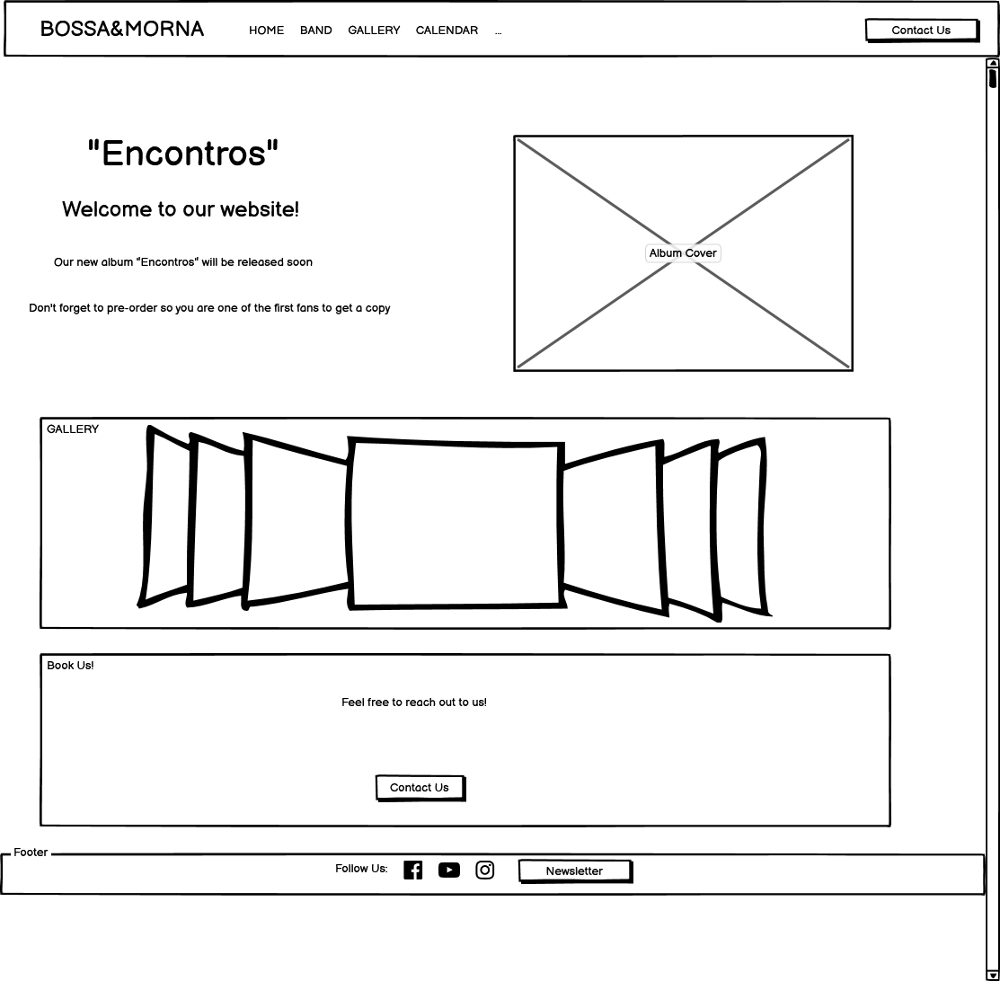
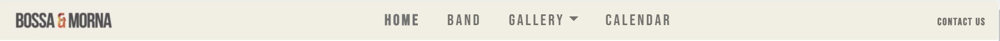

# Bossa&Morna Website

Bossa&Morna is a Portuguese band formed by three young musicians whom combine portuguese, african and brazilian music. 
This website is for everyone interested in this band's work. Doesn't matter if you know nothing about Bossa&Morna or if you are already a fan, there's content for everyone to enjoy. 
From videos to photos, media is available for any user to get to know and enjoy its sounds which originate from a mixture between ex portuguese colonies and portuguese music itself. 
Teir brand new album is being released so anyone interested in reserving their copy can submit a pre-order. This guarantees priority in getting a "fresh out of the oven" copy to enjoy and release those good vibes.
Because the album is not the only thing going on, there's a calendar with upcoming events so that the user can check and even add a reminder to their calendar with a click of a button. 
Last but not least, because Bossa&Morna likes to be in close contact with their public, anyone can contact them using the Contact Us form. This form is also intended for any agent or event
organizer that whiches to reach out to the band. 

This website's goals are:
* Increase the band's fan base.
* Create more proximity with the band's fans.
* Try to increase the revenue from sellinf their new album by giving the fans an opportunity to pre-order the new album.
* Give the opportunity for any agent of event organizer to get a good idea of their image as a band and to know their work.
* Make it easier for any agent or event organizer to contact the band and try to book an event.

A live demo of website can be found [here](https://claudio-c-santos.github.io/Milestone-Project-1/). It is compatible from small to big screen sizes. 
 
## UX

The main users of this website will be fans, agents and event organizers. Each of them can use this website as a tool to obtain valuable information about the band and interact with them. 
Below are two previews of the website in a desktop sized screen and mobile screen.

- <ins>Desktop View</ins> 
 

- <ins>Mobile View</ins> 
 

### User stories
- As a new user that doesn't know anything about the band, I want to know what type of music they play by hearing a song or two.
- As a new user that doesn't know anything about the band, I want to know more about the band and its musicians.
- As a new user that doesn't know anything about the band, I want to have a good idea of the band's image.
- As a fan, I want to be updated on the upcoming events, so that I can attend.
- As a fan, I want to be able to easily find links to their social media profiles, so that I can follow their work.
- As a fan, I want to play their songs on the website, so that I can enjoy it.
- As an agent, I want to know what type of music the band plays, so that I can decide if I should approach them to try represent them.
- As an agent, I want to contact the band, so that I can offer my services to represent them.
- As an event organizer, I want to contact the band, so that I can book their services for a specific day.

### Strategy
The goal of this website's design is to provide a good user experience when navigating through the website looking for the desired information or content. The navigation should be straight forward
as every page has a link on the navigation bar which displays in all of them.

### Scope
The information is displayed thinking about the three main users of this website. Everything is organized in order to make it fluid for everyone, giving them an oportunity to perform the desired task and receive additonal and useful information.

### Structure
The structure was thought to be fluid. When the user enters the website, immediately has an overview of all the sections available going from home to a contact us pages.
On the Home page, the first thing that is shown is the fact that a new album will be released and that a pre-order can be submitted with a button that links to the related page.
Then there's a page about the band so that the user can have more insight on what the band is all about and a small biography on each of the musicians.
Gallery is divided in videos and pictures.
Then there are two forms, one to pre-order the new album and to contact the band. These two pages are linked by a side area with links between both of them.

### Wireframes

- <ins>Home</ins> 
 

- <ins>Band</ins> 
 

- <ins>Gallery Videos</ins> 
 

- <ins>Gallery Photos</ins> 
 

- <ins>Calendar</ins> 
 

- <ins>Pre-Order Form</ins> 
 

- <ins>Contact Us Form</ins> 
 

### Surface

The color scheme is based on the band's album cover which was designed by professional designer.

## Features 

Each section of the website has its own features and serves a specific purpose, please find the details below:

- <ins>Navigation Bar</ins> 
    - Is displayed in all pages, with direct links for each of the other pages. It includes a conventionally placed logo on the left and a Contact Us button which highlights when hovered. 
    On small devices the links and Contact Us button collapsee into a toggle button. The links are then displayed horizontally. On both small and medium screens the buttons display the same style has when hovered in bigger screens. 
     
        - <ins>Desktop View</ins>  
     
     
     
        - <ins>Mobile View</ins> 
     
    

- <ins>Footer</ins> 
    - Also displayed in every page, gives access to band's social media profiles and allows the user to subscribe to band's newsletter. 
    This section doesn't have significant changes when viewed in small screens, besides the fact that the Newsletter Subscription button displays below the input area instead of on the left. 
     
    

- <ins>Home</ins> 
    - The home page is divided in three sections which are: the announcement of the new album and link to pre-order form, a carousel with some of pictures included in the gallery and a last section 
to incentivate the user to reach out to the band. The first section has the goal of calling for the users attention that the band has a new album coming out using a minimalist layout and displaying a noticeable pre-order button. 
    On small screens this section is organized vertically. 
     
        - <ins>Desktop View</ins>  
     
     
     
        - <ins>Mobile View</ins> 
     
    

- <ins>Band</ins> 
    - This page starts by giving a insight on how the band started and where they get their inspiration to create their music. This gives a good idea to the user on what to expect. 
    Then there's three sections, one for each musician. In each section there's a profile picture, links to their personal social media profiles along with a short biography and musical background. 
    This page's layout doesn't change in medium or small screens. 
     
    

- <ins>Gallery</ins> 
    - This section is divided into two pages: videos and pictures of the band performing. The videos are hosted by YouTube from where the embed iFrame code was sourced, the pictures were taken from the band's social media profiles. 
    These pages' layouts don't change in medium or small screens. 
     
    
     
    

- <ins>Calendar</ins> 
    - This page is where upcoming events are announced. Displaying a card per event, the user can quickly see which venue and its location, date and add it to the calendar by clicking the button in the card. 
    This page's layout doesn't change in medium or small screens. 
     
    

- <ins>Contact Us/Pre-order</ins> 
    - These two pages include a form to contact the band and another one to pre-order the new album. On the left of both these pages there's a column with the album's cover on top of two button that link to both forms. Both forms have the same layout however serve different purposes. 
    The Contact Us form page allows the user to enter its first and last name along with their email and message, these details are mandatory. In case that the user is an event organizer or agent, there's an input for date in order to check the band's availability. 
    The Pre-Order form page is intended for users to reserve their copy of the album once it's released. The user will have to provide its first and last names along with email address, these details are mandatory. The user has three payment method options available: direct debit, credit card and paypal. 
    In order not to disrupt the user's experience, in small screens the left column (where album cover and buttons are displayed) is removed. 
     
        - <ins>Contact-Us Desktop View</ins>  
     
     
     
        - <ins>Contact-Us Mobile View</ins> 
     
     
     
        - <ins>Pre-Order Desktop View</ins>  
     
     
     
        - <ins>Pre-Order Mobile View</ins> 
     
    

### Existing Features

- <ins>Feature 1</ins> 
    - Allows a new user that doesn't know anything about the band to immediately see the available content by looking at the navigation bar.

- <ins>Feature 2</ins>
    - Allows a new user that doesn't know anything about the band to read the band's history along with each musician's biography. 
     

- <ins>Feature 3</ins>
    - Allows a new user that doesn't know anything about the band to watch some videos and pictures of their performances by navigating to the Gallery, this will also aid in getting a good idea fo the band's image on stage. 
     

- <ins>Feature 4</ins>
    - Allows users to be updated on the upcoming events by navigating to the Calendar. The event can be added to the fans calendar by clicking the "Add to calendar" button. 
     

- <ins>Feature 5</ins>
    - Allows user to easily find links to their social media profiles by scrolling down to the pages footer. 

- <ins>Feature 6</ins>
    - Allows user to pre-order the band's new album by submitting their personal details and email address. 
     

- <ins>Feature 7</ins>
    - Allows user to have access to the band's newsletter by submitting their email address in the form at the page's footer. 
     

- <ins>Feature 8</ins>
    - Allows user to contact the band by navigating to the Contact Us form. This form allows to choose a date in case of wanting to book an event or a meeting. 
     

## Technologies Used

- This website uses HTML and CSS programming languages.
- [Bootstrap v4.5.x](https://getbootstrap.com/)
    - The layout of this website is based on Boostrap's Grid system.
    - Already styled buttons were used as a starting point however they were personalized in order to get the final result we see along the website.
    - Navigation bar is based on its navbar component and styled to achieve the final result. In order to collapse it when displayed on small screens, Bootstrap's JavaScript CDN was used.
    - On the home page, the carousel is a Bootstrap predefined component. 
    - Cards were used to displayed upcoming events on the Calendar page.
- [Google Fonts](https://fonts.google.com/)
    - Roboto and Bebas Neue font styles were used. For Roboto the follwing font weights were included: 100, 300, 400, 500, 700 and 900.
- [FontAwesome](https://fontawesome.com/)
    - FontAwesome's free icons were used in the Pre-Order page for the different payment methods.

## Testing

All the tests done to this website can be found in [TESTING.md](TESTING.md)

## Deployment

This project was developed using Gitpod IDE, committed to git and pushed to GitHub using the built in function within Gitpod.

To deploy this page to GitHub Pages from its GitHub repository, the following steps were taken:
1. Log into [GitHub](https://github.com/).
2. Navigate to my repositories and select **Claudio-C-Santos/MS1-bossamorna-website**.
3. From the menu items below the repository name, select **Settings**.
4. Scroll down to the **GitHub Pages** section.
5. Under **Source** click the drop-down menu and select **Master Branch**. The **Master Branch** is where the deployed version can be accessed, the difference from the **Development Branch** is that in this last branch the files are commented to assist the user to read the code correctly.
6. On selecting Master Branch the page is automatically refreshed, the website is now deployed.

### Procedure to run code locally

1. Log into [GitHub](https://github.com/).
2. Navigate to my repositories and select **Claudio-C-Santos/MS1-bossamorna-website**.
3. Under the repository name, click "Clone or download".
4. Click on dropdown button Code above the repository files area.
5. In your local IDE open Git Bash.
6. Access the directory you wish to clone the respository into.
7. Type git clone and then paste the URL you copied in Step 3 like this "git clone https://github.com/Claudio-C-Santos/MS1-bossamorna-website.git"
9. Press Enter. Your local clone will be created.

## Credits

### Content

- The album cover images were provided by the band.
- The texts about the band and each musician was based on their social media profiles like Facebook, Instagram and Youtube.
- Videos were sourced from the band's Youtube profile.

### Media

All the media content displayed in this website was taken from the band's various social media profiles. They authorized it in advance.

### Acknowledgements

Diogo Caetano is a childhood friend of mine so when he told me the band was preparing a new album it gave me inspiration to build this website. 
My mentor, Gurjot Singh helped on any issue I came accross and made an effort to keep me in track and not lose motivation.